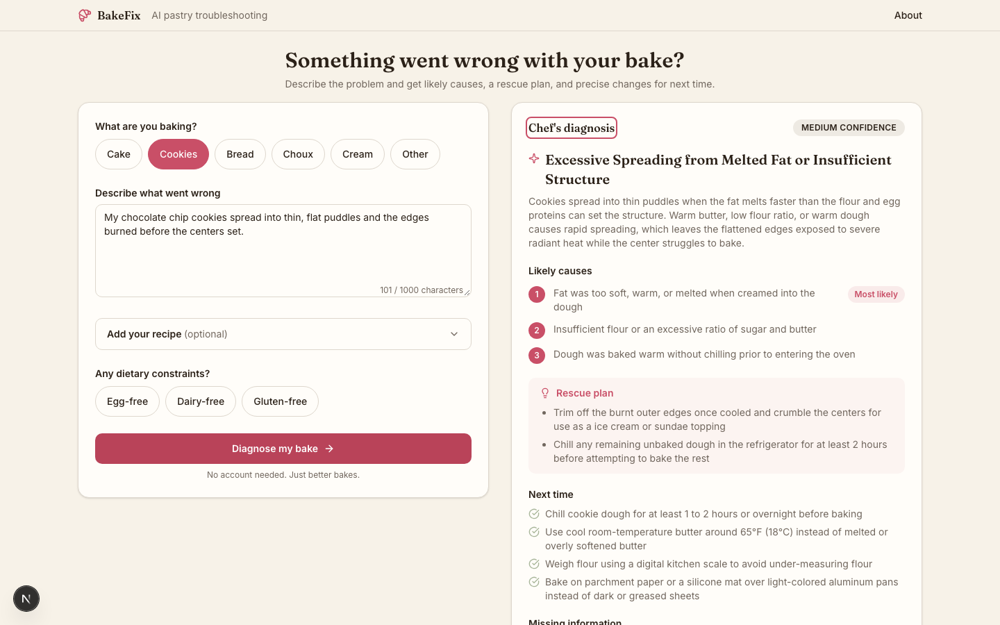

# BakeFix

AI-powered pastry troubleshooting. Describe what went wrong with a bake and
get a structured diagnosis: likely causes, a rescue plan, and concrete
changes for next time.



**Live demo:** [bakefix.vercel.app](https://bakefix.vercel.app/)

## Problem and solution

Home bakers often know *what* happened (cookies spread flat, choux
collapsed, buttercream split) but not *why*, and generic search results are
slow to narrow down and rarely tied to the specifics of a single bake.
BakeFix takes a short, free-text description of the failure — plus an
optional recipe, technical details, and dietary constraints — and returns a
single, structured diagnosis grounded in pastry technique: ranked likely
causes, an optional rescue plan for the batch in front of you, and specific
changes for next time. No account, no saved history — describe the problem
once and get an answer.

## Core features

- One responsive page covering the full flow: category, problem
  description, optional recipe and technical details, dietary constraints,
  and the resulting diagnosis.
- Six pastry categories (Cake, Cookies, Bread, Choux, Cream, Other) and
  three dietary constraints (Egg-free, Dairy-free, Gluten-free).
- A structured diagnosis: headline, explanation, confidence level, one to
  three ranked causes, rescue steps, next-time recommendations, missing
  information, and an optional food-safety note.
- Distinct empty, loading, success, and error states; a failed request
  never clears the form.
- Fully keyboard-operable, with visible focus states and focus moved to the
  diagnosis heading on success.
- Mobile (390px) through desktop (1440px) layouts with no horizontal
  overflow.

## Architecture and data flow

```text
BakeForm (client component)
  -> POST /api/diagnose
  -> app/api/diagnose/route.ts   validates the request body
  -> lib/ai/diagnose.ts          server-only, calls Gemini
  -> Gemini (Vercel AI SDK)      produces structured output
  -> lib/ai/schema.ts            validates the response shape
  -> DiagnosisCard                renders the typed result
```

- **Next.js App Router, React, strict TypeScript.** Server Components by
  default; `"use client"` is limited to the interactive form and its
  workspace state.
- **`app/`** owns routing and HTTP handling only. `app/api/diagnose/route.ts`
  is a thin handler: parse JSON safely, validate it, call the domain
  function, and map the result to a predictable HTTP response. It contains
  no prompt or model logic.
- **`components/`** owns presentation and interaction. Components never call
  Gemini or touch server secrets directly; they call `/api/diagnose`
  through `lib/diagnose-client.ts`.
- **`lib/ai/`** owns the model boundary: input/output schemas
  (`schema.ts`), prompt construction (`prompt.ts`), fixture data
  (`fixtures.ts`), and the server-only orchestration (`diagnose.ts`). This
  folder has no dependency on React, so the prompt and schemas can be
  tested in isolation.
- **`lib/`** owns environment validation (`env.ts`) and small shared
  utilities.
- Google Gemini is called through the Vercel AI SDK (`@ai-sdk/google`),
  with the model name kept in one constant in `lib/ai/diagnose.ts`. The
  provider was switched from the originally planned OpenAI to Gemini
  during Step 05: the OpenAI account behind this project had no credits,
  and Gemini's free tier removes that blocker for a portfolio project with
  no revenue. The Vercel AI SDK's provider abstraction made this a small,
  isolated change.

## Structured output and validation

Every boundary in the request/response cycle is runtime-validated with
Zod, not just typed at compile time:

- **Input.** `lib/ai/schema.ts` defines `diagnosisInputSchema` (category,
  a 10-1000 character problem description, an optional recipe up to 5000
  characters, optional technical details, and up to three dietary
  constraints). It is shared, unmodified, between the client form
  (`react-hook-form` + `zodResolver`) and the API route, so client and
  server can never validate the same request differently.
- **Output.** `diagnosisSchema` defines the diagnosis shape (headline,
  explanation, confidence, 1-3 causes, 0-4 rescue steps, 1-5 next-time
  items, 0-3 missing-information items, a nullable safety note). The
  Gemini call uses the Vercel AI SDK's `generateText` with
  `Output.object({ schema: diagnosisSchema })`, and the result is
  re-validated against the same schema before it ever reaches a
  component — a model that returns malformed JSON produces a typed
  `INVALID_OUTPUT` error, not a broken UI.
- **Fixture data** (`lib/ai/fixtures.ts`) is parsed through the same output
  schema at module load, so it fails fast if it ever drifts from the
  contract.
- **Errors are classified**, never forwarded raw: `INVALID_INPUT`,
  `AI_UNAVAILABLE`, `INVALID_OUTPUT`, and `RATE_LIMITED` map to
  predictable `{ ok: false, code, message }` responses. Provider errors
  (stack traces, raw API messages) are logged server-side and never sent
  to the browser.
- Both `DiagnosisInput` and `Diagnosis` are inferred from their schemas
  (`z.infer`) rather than hand-duplicated as separate interfaces, so the
  type and its runtime check cannot drift apart. See
  [`context/ai-contract.md`](context/ai-contract.md) for the full contract.

## Agentic development workflow

This project was built in one focused session using an agent (Claude
Code), with the product, domain, architecture, and review decisions owned
by a human, not delegated to the model. It is AI-assisted engineering, not
an autonomous build:

- Project intent, constraints, and conventions are written down once in
  `context/` (`product.md`, `architecture.md`, `code-standards.md`,
  `ui-tokens.md`, `ai-contract.md`, `build-plan.md`) rather than re-explained
  every session. Every agent invocation reads this context before touching
  code.
- Work is broken into a fixed, numbered `build-plan.md`, executed one step
  at a time through a repeatable `build-step` skill: read context, locate
  the step, propose a plan, implement only that step's scope, run the
  step's verification commands, update `context/progress.md`.
- A separate `review` skill re-reads the implementation against product,
  architecture, and design requirements before a step is committed, and a
  `recover` skill handles cases where a normal fix attempt doesn't resolve
  a failure — both keep the human reviewing agent output rather than
  trusting it.
- The human approves the plan before implementation, inspects the app and
  the diff after, approves only confirmed review findings, and commits and
  pushes manually — nothing is auto-committed.
- `context/progress.md` is the running log of what was actually built,
  including decisions the plan didn't anticipate (e.g. the OpenAI-to-Gemini
  swap above), so later steps and later sessions have accurate history
  instead of only the original plan.

## Testing and AI evaluation strategy

Two different kinds of correctness are tested differently:

**Deterministic application behavior** (fast, CI-gated, no API key):

- Unit tests (`tests/ai/`) for `diagnosisInputSchema` and `diagnosisSchema`
  valid/invalid cases, fixture conformance, and prompt construction with
  and without optional fields.
- A component test (`tests/components/DiagnosisWorkspace.test.tsx`) that
  drives the real form against a mocked `diagnose-client`: blocked invalid
  submission, chip selection producing the correct payload, the loading
  state, a successful render, and a failed request that preserves the
  user's typed input.
- One Playwright journey (`e2e/diagnose-flow.spec.ts`) that mocks
  `/api/diagnose` and drives the full flow — category, description,
  constraint, submit, loading, result, and focus landing on the diagnosis
  heading — entirely by keyboard, plus a check for no horizontal overflow
  at a 390px viewport.
- All of the above run in CI (`.github/workflows/ci.yml`) and require no
  `GEMINI_API_KEY`.

**Variable AI behavior** (manual, real model, not CI-gated):

- `evals/` defines five pastry-domain cases (melted-butter cookies
  spreading, collapsed choux, split buttercream, dense under-fermented
  bread, and vague/insufficient input) in `evals/cases.ts`.
- `pnpm eval:ai` POSTs each case to a running `/api/diagnose`, validates
  the response against `diagnosisSchema`, and does a loose keyword check
  for the concepts a correct diagnosis should mention.
- This is a coarse sanity check, not a rubric: Gemini's output is
  non-deterministic and keyword matching can pass a wrong answer or fail a
  correctly-phrased one. It also spends real API quota. See
  [`evals/README.md`](evals/README.md) for details and limitations, and
  run it manually — it is deliberately excluded from `pnpm test` and CI.

## Local setup

```bash
pnpm install
cp .env.example .env.local   # then fill in GEMINI_API_KEY
pnpm dev
```

Open [http://localhost:3000](http://localhost:3000).

### Environment variables

| Variable         | Required | Notes                                                   |
| ---------------- | -------- | -------------------------------------------------------- |
| `GEMINI_API_KEY` | Yes, to call Gemini | Server-only. Never prefix with `NEXT_PUBLIC_`. Get a key at [Google AI Studio](https://aistudio.google.com/). |

Without a key, the app still builds, lints, type-checks, and runs its full
automated test suite — `GEMINI_API_KEY` is only read when a request
actually reaches `/api/diagnose`. Missing or invalid credentials there
surface as a normal `AI_UNAVAILABLE` error, not a crash.

### Scripts

```bash
pnpm lint        # Biome
pnpm typecheck   # tsc --noEmit
pnpm test        # Vitest unit/component tests
pnpm test:e2e    # Playwright
pnpm build       # production build
pnpm eval:ai     # manual pastry-domain evaluations (needs a running dev server + GEMINI_API_KEY)
```

## Deployment

Deployed on [Vercel](https://vercel.com/): the GitHub repository is
imported directly, with `GEMINI_API_KEY` set in the project's environment
variables. Live at [bakefix.vercel.app](https://bakefix.vercel.app/).

## Tradeoffs and future improvements

Deliberately out of scope for this MVP, in favor of shipping one well-tested
flow in a day (see `context/product.md`):

- **No authentication, database, or saved history.** A single bounded
  request/response was enough to validate the product's core value; adding
  persistence would have meant designing and testing a data layer instead
  of the diagnosis itself.
- **No multi-agent runtime or RAG.** One structured-output call to Gemini,
  given the information the user actually provides, is sufficient for this
  problem; a retrieval or multi-step agent pipeline would add latency,
  cost, and failure surface without a corresponding accuracy gain at this
  scope.
- **No image upload.** Diagnosing from a photo is a materially different
  (and harder) problem than diagnosing from a description; it's a natural
  next feature rather than part of the MVP.
- **No streaming.** The diagnosis is a single small structured object,
  returned in roughly 10-15 seconds; streaming would add UI complexity
  (partial, possibly invalid JSON) without a proportional UX benefit at
  that latency.

Natural next steps: image upload for visual defects (crumb shot, cookie
spread), a lightweight feedback signal on whether a diagnosis was useful
(without adding a database), and expanding the pastry-domain evaluation set
in `evals/cases.ts` as new failure modes come up.

## Project structure

```text
app/            routes, layouts, page composition, the /api/diagnose handler
components/     presentation and interaction (Server Components by default)
lib/ai/         model config, prompts, input/output schemas, orchestration
lib/            environment validation and shared utilities
tests/          unit and component tests
e2e/            Playwright user-flow tests
evals/          manual pastry-domain AI evaluation set
context/        product, architecture, design, and workflow documentation
```

See [`context/architecture.md`](context/architecture.md) for the full set
of architectural invariants and boundaries.
